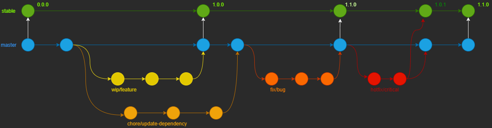

# GitGud Flow : Branching Submodel

**Table of Contents:**

* [GitGud Flow : Branching Submodel](#gitgud-flow--branching-submodel)
	* [1 - The Model](#1---the-model)
		* [1.1 - The basic working of this flow](#11---the-basic-working-of-this-flow)
	* [2 - Permanent Branches](#2---permanent-branches)
		* [2.1 - Stable Branch](#21---stable-branch)
			* [2.1.1 - Stable Branch Guidelines](#211---stable-branch-guidelines)
			* [2.1.2 - Stable Branch Merging Rules](#212---stable-branch-merging-rules)
			* [2.1.3 - Stable Branch Naming Convention](#213---stable-branch-naming-convention)
		* [2.2 - Master Branch](#22---master-branch)
			* [2.2.1 - Master Branch Guidelines](#221---master-branch-guidelines)
			* [2.2.2 - Master Branch Merging Rules](#222---master-branch-merging-rules)
			* [2.2.3 - Master Branch Naming Convention](#223---master-branch-naming-convention)
	* [3 - Working Branches](#3---working-branches)
		* [3.1 - WIP Branches](#31---wip-branches)
			* [3.1.1 - WIP Branches Guidelines](#311---wip-branches-guidelines)
			* [3.1.2 - WIP Branches Merging Rules](#312---wip-branches-merging-rules)
			* [3.1.3 - WIP Branches Naming Convention](#313---wip-branches-naming-convention)
		* [3.2 - Fix Branches](#32---fix-branches)
			* [3.2.1 - Fix Branches Guidelines](#321---fix-branches-guidelines)
			* [3.2.2 - Fix Branches Merging Rules](#322---fix-branches-merging-rules)
			* [3.2.3 - Fix Branches Naming Convention](#323---fix-branches-naming-convention)
		* [3.3 - Chore Branches](#33---chore-branches)
			* [3.3.1 - Chore Branches Guidelines](#331---chore-branches-guidelines)
			* [3.3.2 - Chore Branches Merging Rules](#332---chore-branches-merging-rules)
			* [3.3.3 - Chore Branches Naming Convention](#333---chore-branches-naming-convention)
		* [3.4 - Hotfix Branches](#34---hotfix-branches)
			* [3.4.1 - Hotfix Branches Guidelines](#341---hotfix-branches-guidelines)
			* [3.4.2 - Hotfix Branches Merging Rules](#342---hotfix-branches-merging-rules)
			* [3.4.3 - Hotfix Branches Naming Convention](#343---hotfix-branches-naming-convention)
	* [4 - Optional Versioning Branches](#4---optional-versioning-branches)
		* [4.1 - Optional Versioning Branches Guidelines](#41---optional-versioning-branches-guidelines)
		* [4.2 - Optional Versioning Branches Merging Rules](#42---optional-versioning-branches-merging-rules)
		* [4.3 - Optional Versioning Branches Naming Convention](#43---optional-versioning-branches-naming-convention)

---

GitGud Flow is a branching model that helps maintaining your code clean and reliable in case of something breaking. This document will explain the GitGud Flow model. Remember that this only a model, so it provide the base for your own working, use and modify it as needed.

GitGud flow is heavily based from the standard Git Flow, but with some differences. First of all, it is a lot simpler. You merge into master directly and then use another branch to CD. Some naming was also changed to make it more broader and comprehensive.

**Disclaimer:** This guide use the [Commit Guide](../Topics/Commit.md) and the [Pull Request Guide](../Topics/Pull_Request.md) from GitGud. Use them as a base anytime it references any of these two features.

## 1 - The Model

When using the Git Flow you need to understand what you can do and how it works.

Here is the list of branch types in GitGud Flow:

**Permanent branches:**

- *Stable*
- *Master*

**Working branches:**

- WIP
- Fix
- Chore
- Hotfix

Remember that those are only the types of the branches, but the naming is up to you.

### 1.1 - The basic working of this flow

1. You branch off the master branch;
2. You make modifications;
3. You merge back into master branch once is ready;
4. You then merge master branch into the stable branch via Pull Request once all the changes are complete.

## 2 - Permanent Branches

Permanent branches are never receive any direct commits and never gets deleted.

### 2.1 - Stable Branch

This is your release ready branch, here will be only the latest production ready changes.

#### 2.1.1 - Stable Branch Guidelines

- You only have one stable branch;
- **You never commit directly to this branch;**
- This branch is never deleted;

#### 2.1.2 - Stable Branch Merging Rules

- You only merge from master, once all the changes from a version are ready;
- You can only merge hotfix branches;
- When merging, you should always make a Pull Request with a changelog and optionally squash the commits;
- The merge commit message must follow the rules:
  - The message must start the `[merge]` tag and reference the Pull Request number and contain a version, for example:
  - `[merge] VERSION on PR #N`, where *VERSION* is the new stable version and *N* is the Pull Request number, like: `[merge] 1.0.5 on PR #5`.

#### 2.1.3 - Stable Branch Naming Convention

- Lowercase;
- Snake case;
- Descriptive and clear that it is only for stable code.

### 2.2 - Master Branch

This branch is where all the development progress will be made, all features, fixes and changes will go here.

#### 2.2.1 - Master Branch Guidelines

- You only have one master branch;
- It's not advised to commit directly in this branch;
- This branch is never deleted;
- This is your repository default branch.

#### 2.2.2 - Master Branch Merging Rules

- You only merge complete wip branches;
- You can merge any fix;
- You can merge any chore branch;
- If working with a team : When merging you should make a Pull Request, with a custom commit message:
  - The message must start the `[merge]` tag and reference the branch name and the Pull Request number, for example:
  - `[merge] Complete: SUBJECT on PR #N`, where *SUBJECT* is what feature is being added/updated/removed and *N* is the Pull Request number;
  - `[merge] Fix: SUBJECT on PR #N`, where *SUBJECT* is what problem is being fixed and *N* is the Pull Request number.
- If working alone : merge the branch directly.

**Merge Commit message exemples:**

- `[merge] Complete: Add REST API on PR #123`
- `[merge] Fix: Server crash on PR #456`
- `[merge] Complete: Remove login page on PR #789`
- `[merge] Complete: Update dependencies on PR #321`

#### 2.2.3 - Master Branch Naming Convention

- Lowercase;
- Snake case;
- This can be anything you want, and usually is left to the git into default.

## 3 - Working Branches

Working branches receive direct commits and can be freely edited by the developers.

### 3.1 - WIP Branches

The most used of them all, is where you test new features, change or update things.

#### 3.1.1 - WIP Branches Guidelines

- You can have multiple wip branches;
- WIP branches are deleted after they are merged into the development branch;
- You can commit freely and test in them at will.

#### 3.1.2 - WIP Branches Merging Rules

- You will only merge a complete wip branch to the master branch.

#### 3.1.3 - WIP Branches Naming Convention

- Lowercase;
- Snake case;
- Prefixed with `wip/`;
- Descriptive and clear of its purpose, be a new feature or a change.

### 3.2 - Fix Branches

Fix branches are used to fix bugs, missing resources found in the master branch. Mainly used for uncaught issues in tests or runtime issues not detected in the development.

#### 3.2.1 - Fix Branches Guidelines

- You can have multiple bugfix branches;
- Fix branches are deleted after they are merged into the master branch;
- You can fix more than one bug on the branch.

#### 3.2.2 - Fix Branches Merging Rules

- You will only merge a complete fix branch in the development branch.

#### 3.2.3 - Fix Branches Naming Convention

- Lowercase;
- Snake case;
- Prefixed with `fix/`;
- Descriptive and clear of its purpose. What are you fixing ?

### 3.3 - Chore Branches

This type of branch is only used when updating dependencies, frameworks, build tasks and other updates required.

#### 3.3.1 - Chore Branches Guidelines

- You can have multiple chore branches;
- Chore branches are deleted after they are merged into the development branch;
- You can only make commits related to chores.

#### 3.3.2 - Chore Branches Merging Rules

- You will only merge a complete chore branch that has passed all tests to the master.

#### 3.3.3 - Chore Branches Naming Convention

- Lowercase;
- Snake case;
- Prefixed with `chore/`;
- Descriptive and clear of its purpose. What chore are you doing ? Updating some dependency ? Documentation ?

### 3.4 - Hotfix Branches

This branch is a priority fix, when you find a serious bug in the stable branch that needs to be resolved as soon as possible, you commit to a hotfix branch to resolve it.

#### 3.4.1 - Hotfix Branches Guidelines

- Hotfix branches are based of the stable branch;
- Hotfix branches are deleted after they are merged into the stable branch;

#### 3.4.2 - Hotfix Branches Merging Rules

- After the hotfix is complete, you merge it to stable and master branches.

#### 3.4.3 - Hotfix Branches Naming Convention

- Lowercase;
- Snake case;
- Prefixed with `hotfix/`;
- Descriptive and clear of its purpose.

## 4 - Optional Versioning Branches

Those are branches that are not present in the model, but can be used if needed. For example:

- A beta branch;
- A public_test branch;
- A release candidate branch.

### 4.1 - Optional Versioning Branches Guidelines

- **You never commit directly to this branch;**
- This branch is deleted after its respective version reaches end of life;

### 4.2 - Optional Versioning Branches Merging Rules

- You only merge from master, once all the changes from a version are ready;
- You can only merge hotfix branches;
- When merging, you should make a Pull Request with a changelog and squash the commits.

### 4.3 - Optional Versioning Branches Naming Convention

- Lowercase;
- Snake case;
- Descriptive and clear that it is only for a specific version. (For example: beta_1, rc_2 or alpha_3)
